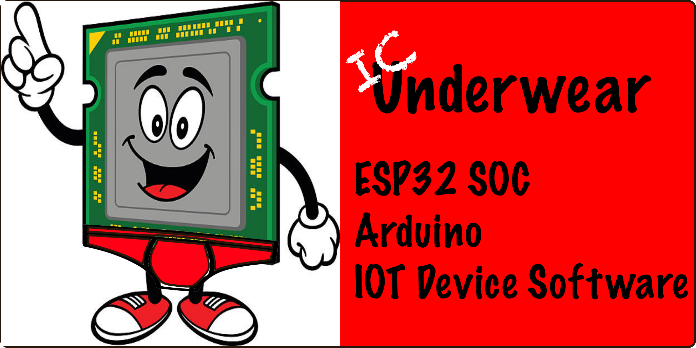

# icUnderwear - The starting point for ESP32 Arduino based robot projects

## Table of contents
* [Overview](#Overview)
* [Features](#Features)
* [Compatabillity](#Compatability)
* [Development environment](#Development-environment)
* [Code documentation](#Code-documentation)
* [Downloading](#Downloading)
* [Testing](#Testing)
* [Releases](#Releases)
* [Acknowledgements](#Acknowledgements)

## Overview
This repository contains Arduino code that get you off to a flying 
start when you start you next robot project. Simply clone this 
template repository and use the source code to boot strap the 
development of your robot's integrated circuit firmware. 

## Features

* Modular code for easy maintenance
* Hardware aware for easy configuration
* Supports typical subsystems found in robot projects   
* Repo auto generates online documentation
* MIT License

## Compatability 

* This code has only been tested on the 
[Adafruit Huzzah32](https://learn.adafruit.com/adafruit-huzzah32-esp32-feather) 
development board containing the 
[Espressif ESP WROOM32 SOC](https://www.espressif.com/sites/default/files/documentation/esp32_datasheet_en.pdf) 
featuring a pair of [Cadence/Xtensa®32-bit LX6 microprocessors](https://mirrobo.ru/wp-content/uploads/2016/11/Cadence_Tensillica_Xtensa_LX6_ds.pdf). 

## Development environment
This library was written using the following tools:
*  
Microsoft's Visual Studio Code source code editor. 
*  
PlatformIO plugin 
[embedded software](https://en.wikipedia.org/wiki/Embedded_software) application 
[IDE](https://en.wikipedia.org/wiki/Integrated_development_environment). 

## Downloading
These instructions assume that you have [Git](https://git-scm.com/) installed on 
your computer.

1. Navigate to the Arduino project directory on your computer.
2. Issue the command `git clone https://github.com/theAgingApprentice/{projectName.git}`.
3. Issue the command `git remote`. If you get back the response *origin* then 
you are all set. If you get a blank response back then you must set up an 
association to the remote repository by issuing the command `git remote add 
origin https://github.com/theAgingApprentice/{projectName.git}` to set up the remote. 

## Testing
At this time we do not have a way t test this embedded code.

## Releases
* We use the [SemVer](http://semver.org/) numbering scheme for our releases. 
* The latest stable release is [v1.0.0](https://github.com/theAgingApprentice/underwear/releases/tag/v1.0.0).

## Acknowledgements
* The many folks involved in porting the Arduino libraries over to the ESP32 SOC.
* Adafruit for their excellent freely available tutorials.
